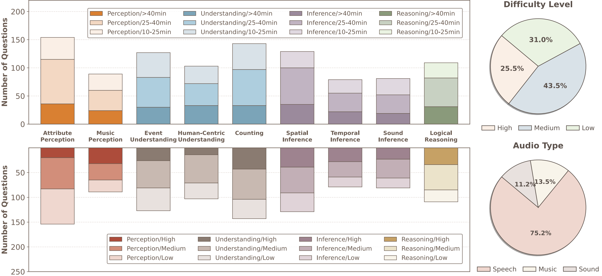
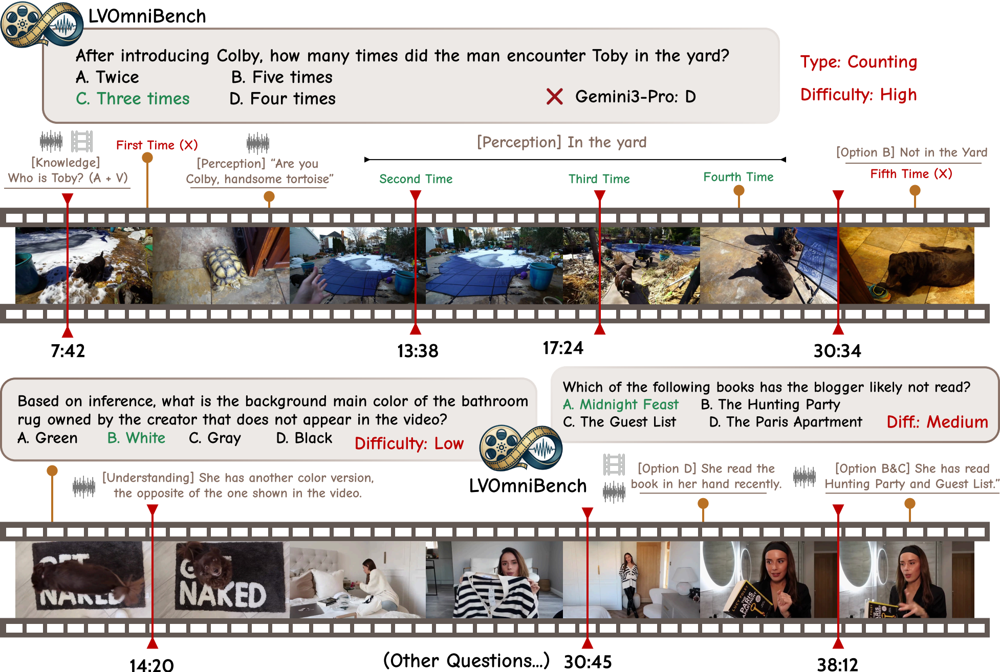
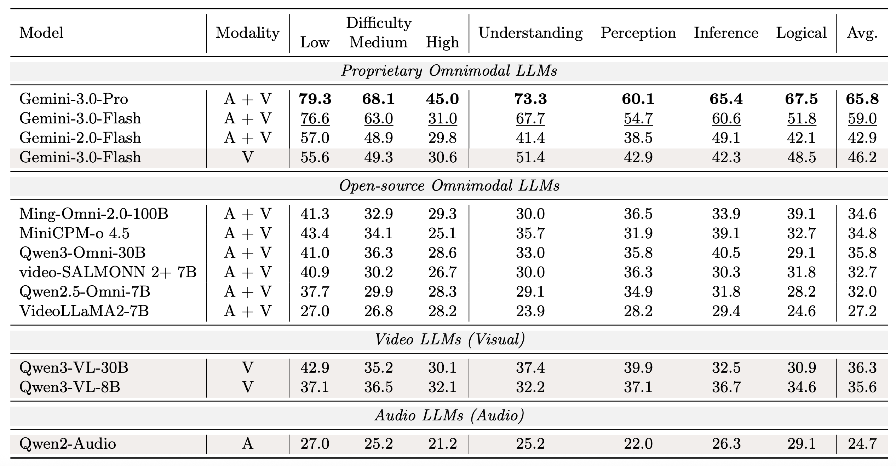
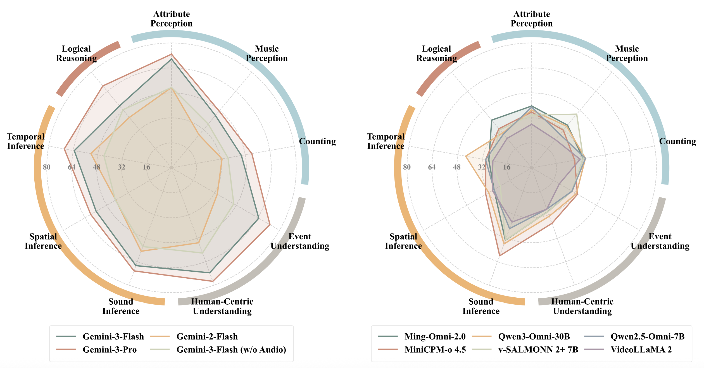

<div align="center">

<p align="center">
  
</p>

<h1>LVOmniBench: Pioneering Long Audio-Video Understanding Evaluation for Omnimodal LLMs</h1>

 
 

 

<font size=7><div align='center' > [[Project Page](https://kd-tao.github.io/LVOmniBench/)] [[Paper](https://arxiv.org/abs/2603.19217)] [[Dataset](https://huggingface.co/datasets/KD-TAO/LVOmniBench)]  </div></font>

LVOmniBench is a new audio-visual understanding evaluation benchmark in long-form audio-video inputs. 🌟

</div>


## 🔥 News
* **`2026.03.19`** 🌟 We are very proud to launch LVOmniBench, the pioneering comprehensive evaluation benchmark of OmniLLMs in Long Audio-Video Understanding Evaluation!


## ✨ LVOmniBench Introduction

Recent advancements in omnimodal large language models (OmniLLMs) have significantly improved the comprehension of audio and video inputs. However, current evaluations primarily focus on short audio and video clips ranging from 10 seconds to 5 minutes, failing to reflect the demands of real-world applications, where videos typically run for tens of minutes. To address this critical gap, we introduce LVOmniBench, a new benchmark designed specifically for the cross-modal comprehension of long-form audio and video.


* We curated a diverse collection of long videos, with durations ranging from
**10 to 90 minutes** and an average duration of **2,069s**. This duration represents
a greater than sixfold increase in temporal scale compared to that of existing
benchmarks for audio-visual understanding.

*  We **manually constructed 1,014
high-quality multiple-choice questions**, which are explicitly designed to require
joint reasoning across the audio and visual modalities, thereby facilitating a more
comprehensive evaluation of OmniLLMs.

*  Each QA is ranked by difficulty level, and long audio-video understanding poses significant challenges for both current proprietary and open source models!


<p align="center">
    
</p>

## 🌰 Dataset Examples

<p align="center">
    
</p>


## 🔮 Evaluation

📍 **Prompt**:

The common prompt used in our evaluation follows this format:

```python
prompt_text = (
    f"Question: {question}\n"
    f"Options:\n{options_str}\n\n"
    "Select the best answer from the options above. "
    "Directly provide the letter representing your choice (A/B/C/D) and nothing else. "
    "Do not include the full text of the option, do not provide any explanation."
)
```

📍 **Leaderboard**: 

If you want to add your results to our LVOmniBench leaderboard, please contact us at **taokeda@westlake.edu.cn**


## 🏆 Experimental Results
- **Evaluation results of different OmniLLMs.**

<p align="center">
    
</p>


- **Evaluation results across different task types.**

<p align="center">
    
</p>


<!-- ## Related Works

#### [Awesome Audio-Visual Understanding Benchmark] Here, we summarize the existing audio-visual understanding benchmarks for OmniLLMs. -->


## 🌍 Citation

If you find our work helpful for your research, please consider citing our work.   

```bibtex
coming soon
```

